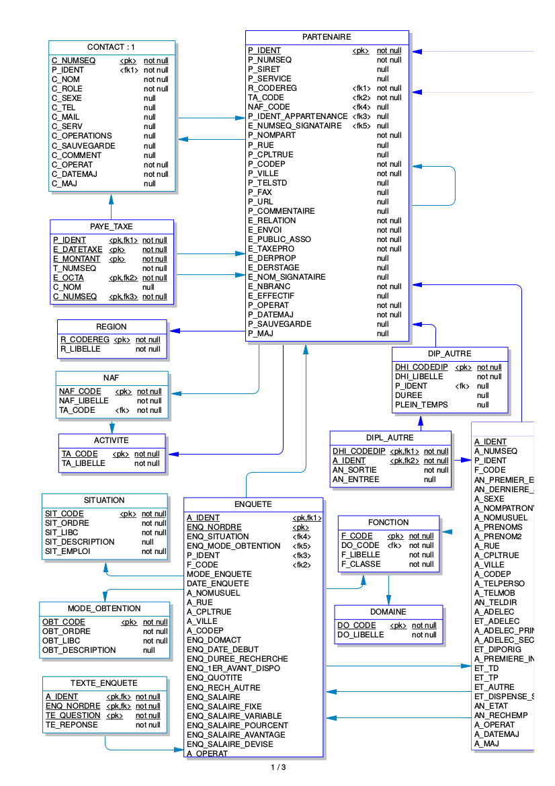
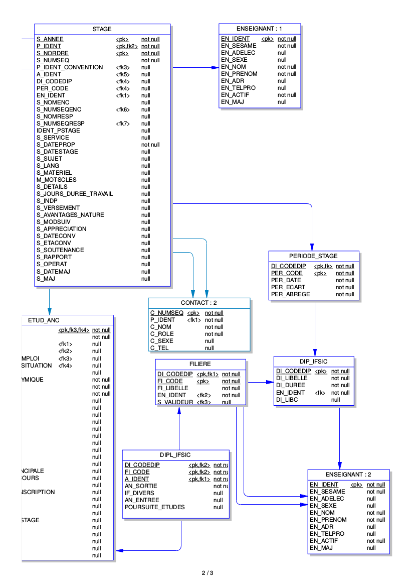
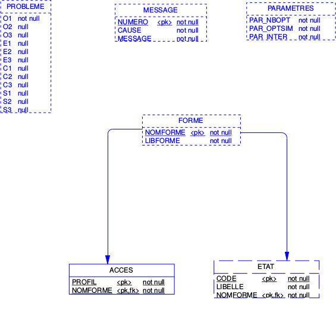

# Projet GLI/TAA 2016

Le but du projet GLI/TAA cette année vise à redévelopper une brique du système d'information de l'ISTIC concernant la partie CRM (Gestion de la relation client) et gestion des stages.

Nos clients au sens du CRM sont nos étudiants et l'ensemble des entreprises avec lesquels nous avons des relations (accueil de stagiaire, fournisseur, entreprise partenaire, donateur pour la taxe professionnelle, ...). Pour gérer ces données, nous disposons d'une base de données conçues il y a quelques années mais les interactions avec cette applicatif se font uniquement en SQL pour insérer des données et requeter ces données.

Une petite partie IHM existe pour la partie gestion des stages des étudiants afin d'éditer les conventions et de laisser les étudiants saisir leur lieu de stage.

Les deux principales difficultées du projet réside:

1. dans le fait que même si l'on souhaite avoir une interface WEB érgonomique pour interagir avec cette nouvelle application, il est aussi nécessaire de prévoir des **APIs** documentées pour importer et exporter des données. En effet, de nombreuses données sont issues d'autres applicatifs ou nécessaire dans d'autres applicatifs
2. les données doivent être *figées dans le temps*. Je m'explique, si une entreprise réside au *1 allée de Beaulieu à Rennes* en 1985 et qu'un étudiant est en stage cette année là. Quand nous réditons la convention par exemple en 2015 pour ce stage, l'adresse doit être l'adresse de l'époque même si l'entreprise à déménager. Un étudiant qui ira en stage dans cette même entreprise en 2016 aura la nouvelle adresse sur sa convention.

D'un point de vue fonctionnalité, outre ces API côté serveur, il est à prévoir:

* Des IHMs simple pour naviguer/éditer dans ces données de manière simple.
* Un module pour faire du mailing, c'est à dire un moyen simple d'envoyer un mail à un ensemble de contacts préalablement sélectionnés (ex. toutes les entreprises ayant accuilli un stagiaire cette année).
* Un module pour filtrer des manières avancées ces données
* Un module pour exporter des données au format excel
* Un module éditique pour créer à la volée des documents excel depuis un template de document openoffice (je vous fournirai un exemple)
* un module d'enquête permettant de connaitre la situation des étudiants après le stage, 1 an après le stage, 3 ans après le stage.

## Analyse

Comme c'est une refonte, nous ne partons pas de rien, voici un extrait du modèle de données actuel. N'hésitez pas à repartir de zéro mais vous pouvez vous en servir pour vérifier que vous n'avez pas oublier des classes de données.

Vous pouvez aussi vous inspirer du projet [Fedox](http://fedox.irisa.fr/) pour la specification de la notion d'étudiant.

## Contraintes techniques

Pour ce projet, on se propose d'utiliser Java pour la partie backend serveur et en particulier le framework [Spring](https://spring.io/) et [AngularJS](https://angularjs.org/) pour la partie cliente.

Pour économiser du temps, nous utiliserons le projet [JHipster](http://jhipster.github.io/) pour la première génération du projet, la génération des classes métiers, la génération des premières interfaces et la génération de l'interface d'administration.

## Autres points
* Je partagerai sur cette page des snippets de code suite à des questions
* Pour toutes questions, n'oubliez pas d'utiliser [slack](https://master-istic.slack.com/archives/taa2016).

Pour ce faire, ajouter le mail que vous utilisez pour votre compte slack [ici](https://docs.google.com/spreadsheets/d/13cp7KjoXZa63RIvMUgWL5nVs98w3UdMIX5wdSn-OO1Y/edit?usp=sharing)
